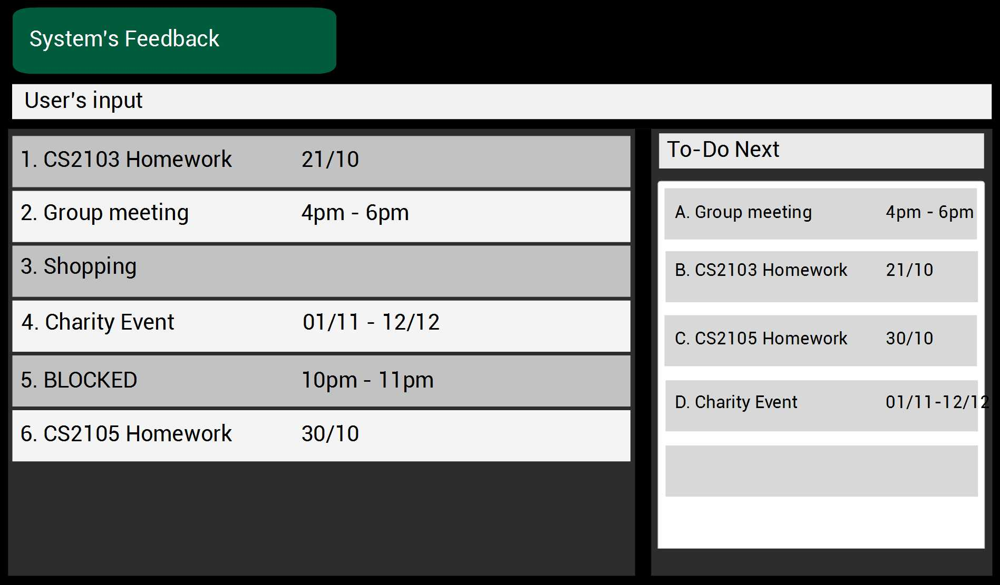

 
# Sudowudo

### User Interface

 

### Introduction

* Sudowudo is a desktop Task Manager application. It's used to keep track of events, deadlines and tasks, desgined espeicially for users who prefer fast input using keyboard.
* It has a GUI for displaying output but most of the user interactions happen using a **CLI** (Command Line Interface).
* It is a **Java** application, developed with **Eclipse IDE** in an **object-oriented** fashion and implements an **event-driven architecture**
* It is the designed to be the final product for the beginner's **Software Engineering course** at the National University of Singapore (NUS). As such, it is built upon an existing product provided by the teaching team.
* Main features:
    * CRUD (create, read, update, delete) functions for tasks.
    * 3 different types of tasks (event, deadline, floating)
    * Natural language for user input
    * Internal visualizer for sorting tasks by urgency and importance

  
### Site Map
* [User Guide](docs/UserGuide.md) 
* [Developer Guide](docs/NewDeveloperGuide.md) 
* [About Us](docs/AboutUs.md)
* [Contact Us](docs/ContactUs.md)

### Acknowledgements

* The original product that this is based on is **addressbook-level4**, developed by the [NUS Software Engineering team](https://github.com/se-edu/)

