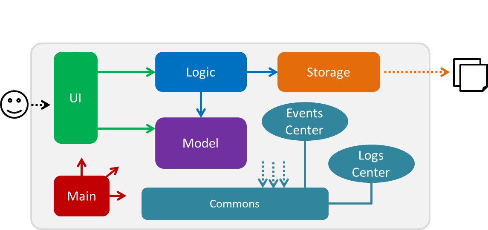

# Developer Guide 

* [Setting Up](#setting-up)
* [Design](#design)
* [Implementation](#implementation)
* [Testing](#testing)
* [Dev Ops](#dev-ops)
* [Appendix A: User Stories](#appendix-a-user-stories)
* [Appendix B: Use Cases](#appendix-b-use-cases)
* [Appendic C: Non-Functional Requirements](#appendix-c-non-functional-product-requirements)
* [Appendix D: Product Survey](#appendix-d-product-survey)

## Setting up

#### Prerequisites

1. **JDK `1.8.0_60`**  or later 

    > Having any Java 8 version is not enough.  
    This app will not work with earlier versions of Java 8.
    
2. **Eclipse** IDE
3. **e(fx)clipse** plugin for Eclipse (Do the steps 2 onwards given in
   [this page](http://www.eclipse.org/efxclipse/install.html#for-the-ambitious))
4. **Buildship Gradle Integration** plugin from the Eclipse Marketplace

#### Importing the project into Eclipse

0. Fork this repo, and clone the fork to your computer
1. Open Eclipse (Note: Ensure you have installed the **e(fx)clipse** and **buildship** plugins as given 
   in the prerequisites above)
2. Click `File` > `Import`
3. Click `Gradle` > `Gradle Project` > `Next` > `Next`
4. Click `Browse`, then locate the project's directory
5. Click `Finish`

  > * If you are asked whether to 'keep' or 'overwrite' config files, choose to 'keep'.
  > * Depending on your connection speed and server load, it can even take up to 30 minutes for the set up to finish
      (This is because Gradle downloads library files from servers during the project set up process)
  > * If Eclipse auto-changed any settings files during the import process, you can discard those changes.
  
#### Troubleshooting project setup

**Problem: Eclipse reports compile errors after new commits are pulled from Git**
* Reason: Eclipse fails to recognize new files that appeared due to the Git pull. 
* Solution: Refresh the project in Eclipse:  
  Right click on the project (in Eclipse package explorer), choose `Gradle` -> `Refresh Gradle Project`.
  
**Problem: Eclipse reports some required libraries missing**
* Reason: Required libraries may not have been downloaded during the project import. 
* Solution: [Run tests using Gradle](UsingGradle.md) once (to refresh the libraries).
 
## Design

### Architecture

 
The **_Architecture Diagram_** given above explains the high-level design of the App.
Given below is a quick overview of each component.

`Main` has only one class called [`MainApp`](../src/main/java/seedu/address/MainApp.java). It is responsible for,
* At app launch: Initializes the components in the correct sequence, and connect them up with each other.
* At shut down: Shuts down the components and invoke cleanup method where necessary.

[**`Commons`**](#common-classes) represents a collection of classes used by multiple other components.
Two of those classes play important roles at the architecture level.
* `EventsCentre` : This class (written using [Google's Event Bus library](https://github.com/google/guava/wiki/EventBusExplained))
  is used by components to communicate with other components using events (i.e. a form of _Event Driven_ design)
* `LogsCenter` : Used by many classes to write log messages to the App's log file.

The rest of the App consists four components.
* [**`UI`**](#ui-component) : Forms the UI of the App.
* [**`Logic`**](#logic-component) : Executes commands on data in the App.
* [**`Model`**](#model-component) : Holds the data of the App in-memory.
* [**`Storage`**](#storage-component) : Reads data from, and writes data to, the hard disk.

Each of the four components
* Defines its _API_ in an `interface` with the same name as the Component.
* Exposes its functionality using a `{Component Name}Manager` class.

For example, the `Logic` component (see the class diagram given below) defines its API in the `Logic.java`
interface and exposes its functionality using the `LogicManager.java` class. 
 

The _Sequence Diagram_ below shows how the components interact for the scenario where the user issues the
command `delete 3`.

<!--- @@author A0144750J --->

<!----@@author------->

>Note how the `Model` simply raises a `TaskBookChangedEvent` when the Task Book data are changed,
 instead of asking the `Storage` to save the updates to the hard disk.

The `EventsCenter` reacts to that event, which eventually results in the updates
being saved to the hard disk and the status bar of the UI being updated to reflect the 'Last Updated' time.

The event is propagated through the `EventsCenter` to the `Storage` and `UI` without `Model` having
  to be coupled to either of them. This is an example of how this Event Driven approach helps us reduce direct 
  coupling between components.

The sections below give more details of each component.

### UI component

<!--- @@author A0092390E --->
 
<!---- @@author-------------->

**API** : [`Ui.java`](../src/main/java/seedu/address/ui/Ui.java)

The UI consists of a `MainWindow` that is made up of parts e.g.`CommandBox`, `ResultDisplay`, `ItemListPanel`,
`StatusBarFooter`, `BrowserPanel` etc. All these, including the `MainWindow`, inherit from the abstract `UiPart` class
and they can be loaded using the `UiPartLoader`.

The `UI` component uses JavaFx UI framework. The layout of these UI parts are defined in matching `.fxml` files
 that are in the `src/main/resources/view` folder. 
 For example, the layout of the [`MainWindow`](../src/main/java/seedu/address/ui/MainWindow.java) is specified in
 [`MainWindow.fxml`](../src/main/resources/view/MainWindow.fxml)

The `UI` component,
* Executes user commands using the `Logic` component.
* Binds itself to some data in the `Model` so that the UI can auto-update when data in the `Model` change.
* Responds to events raised from various parts of the App and updates the UI accordingly.

### Logic component

 

**API** : [`Logic.java`](../src/main/java/seedu/address/logic/Logic.java)

1. `Logic` uses the `Parser` class to parse the user command.
2. This results in a `Command` object which is executed by the `LogicManager`.
3. The command execution can affect the `Model` (e.g. adding a person) and/or raise events.
4. The result of the command execution is encapsulated as a `CommandResult` object which is passed back to the `Ui`.

Given below is the Sequence Diagram for interactions within the `Logic` component for the `execute("delete 1")`
 API call. 

<!---- @@author A0147609X-------------->
 

### Model component

<!-- @@author A0131560U -->
 
<!-- @@author -->

**API** : [`Model.java`](../src/main/java/seedu/address/model/Model.java)

The `Model`,
* stores a `UserPref` object that represents the user's preferences.
* stores the Task Book data.
* uses `ListUtil` in Commons to parse changes to what parts of the data the user wants to see
* does not depend on any of the other three components.

### Storage component

<!-- A0144750J-->
 
<!-- @@author -->

**API** : [`Storage.java`](../src/main/java/seedu/address/storage/Storage.java)

The `Storage` component,
* can save `UserPref` objects in json format and read it back.
* can save the Task Book data in xml format and read it back.

### Common classes

Classes used by multiple components are in the `seedu.addressbook.commons` package.

## Implementation

### Logging

We are using `java.util.logging` package for logging. The `LogsCenter` class is used to manage the logging levels
and logging destinations.

* The logging level can be controlled using the `logLevel` setting in the configuration file
  (See [Configuration](#configuration))
* The `Logger` for a class can be obtained using `LogsCenter.getLogger(Class)` which will log messages according to
  the specified logging level
* Currently log messages are output through: `Console` and to a `.log` file.

**Logging Levels**

* `SEVERE` : Critical problem detected which may possibly cause the termination of the application
* `WARNING` : Can continue, but with caution
* `INFO` : Information showing the noteworthy actions by the App
* `FINE` : Details that is not usually noteworthy but may be useful in debugging
  e.g. print the actual list instead of just its size

### Configuration

Certain properties of the application can be controlled (e.g App name, logging level) through the configuration file 
(default: `config.json`):

## Testing

Tests can be found in the `./src/test/java` folder.

**In Eclipse**:
* To run all tests, right-click on the `src/test/java` folder and choose
  `Run as` > `JUnit Test`
* To run a subset of tests, you can right-click on a test package, test class, or a test and choose
  to run as a JUnit test.

**Using Gradle**:
* See [UsingGradle.md](UsingGradle.md) for how to run tests using Gradle.

We have two types of tests:

1. **GUI Tests** - These are _System Tests_ that test the entire App by simulating user actions on the GUI. 
   These are in the `guitests` package.
  
2. **Non-GUI Tests** - These are tests not involving the GUI. They include,
   1. _Unit tests_ targeting the lowest level methods/classes.  
      e.g. `seedu.address.commons.UrlUtilTest`
   2. _Integration tests_ that are checking the integration of multiple code units 
     (those code units are assumed to be working). 
      e.g. `seedu.address.storage.StorageManagerTest`
   3. Hybrids of unit and integration tests. These test are checking multiple code units as well as 
      how the are connected together. 
      e.g. `seedu.address.logic.LogicManagerTest`

**Headless GUI Testing** :
Thanks to the [TestFX](https://github.com/TestFX/TestFX) library we use,
 our GUI tests can be run in the _headless_ mode. 
 In the headless mode, GUI tests do not show up on the screen.
 That means the developer can do other things on the Computer while the tests are running. 
 See [UsingGradle.md](UsingGradle.md#running-tests) to learn how to run tests in headless mode.
 
#### Troubleshooting tests
 **Problem: Tests fail because NullPointException when AssertionError is expected**
 * Reason: Assertions are not enabled for JUnit tests. 
   This can happen if you are not using a recent Eclipse version (i.e. _Neon_ or later)
 * Solution: Enable assertions in JUnit tests as described 
   [here](http://stackoverflow.com/questions/2522897/eclipse-junit-ea-vm-option).  
   Delete run configurations created when you ran tests earlier.
  
## Dev Ops

### Build Automation

See [UsingGradle.md](UsingGradle.md) to learn how to use Gradle for build automation.

### Continuous Integration

We use [Travis CI](https://travis-ci.org/) to perform _Continuous Integration_ on our projects.
See [UsingTravis.md](UsingTravis.md) for more details.

### Making a Release

Here are the steps to create a new release.
 
 1. Generate a JAR file [using Gradle](UsingGradle.md#creating-the-jar-file).
 2. Tag the repo with the version number. e.g. `v0.1`
 2. [Crete a new release using GitHub](https://help.github.com/articles/creating-releases/) 
    and upload the JAR file your created.
   
### Managing Dependencies

A project often depends on third-party libraries. For example, Address Book depends on the
[Jackson library](http://wiki.fasterxml.com/JacksonHome) for XML parsing. Managing these _dependencies_
can be automated using Gradle. For example, Gradle can download the dependencies automatically, which
is better than these alternatives. 
a. Include those libraries in the repo (this bloats the repo size) 
b. Require developers to download those libraries manually (this creates extra work for developers) 

<!--- @@author A0131560U --->
## Appendix A: User Stories
Priorities: 
- `* * *` -- high priority, must have
- `* *` -- medium priority, good to have
- `*` -- low priority, unlikely to have

Priority | As a ... | I want to ... | So that I can...
-------- | :------- | :------------ | :-----------
`* * *` | new user | see usage instructions | refer to instructions when I forget how to use the App
`* * *` | user | add a new event | 
`* * *` | user | mark an event as completed |
`* * *` | user | change details of an event | update events according to my schedule
`* * *` | user | see whether an event is completed | know what events are incomplete
`* * *` | user | search for an event by keywords |
`* * *` | user | delete an event | remove entries that I cannot complete
`* * *` | user | list all uncompleted events | see what I have left to do
`* *`	| user | schedule multiple time blocks for an event | tentatively plan events
`* *` | user | tag events using particular keywords | group related events
`* *` | user | know what events are urgent | plan my time accordingly
`*`		| user | sort events by deadline | know which events are urgent
`*` 	| user with many tasks | sort events by priority | know which upcoming events are important
`*`   | user | use natural language to type my commands| not have to remember complex commands
`*`   | user | receive feedback when I am typing in commands | know whether I am typing in the command correctly
`*`   | user | have the app autocomplete my task name | more quickly type in commands
`*`   | power user | use keyboard shortcuts to access frequently-used features | more quickly access useful features
<!--- @@author --->

<!--- @@author A0131560U --->
## Appendix B: Use Cases
(For all use cases below, the `System` is Wudodo and the `Actor` is the user, unless specified otherwise)

### Use case: Add task
#### MSS
1. User inputs task details
2. System stores task details in database

#### Extensions
1a. User inputs details in incorrect format
> System displays error message and help text
> Use case resumes at step 1

### Use case: Find  task
#### MSS
1. User inputs search string
2. System shows matching tasks
(Use case ends)

#### Extensions
1a. User inputs invalid search string
> System displays errors message
> Use case resumes at step 1

2a. No matching tasks
> Use case ends
<!--- @@author --->

<!--- @@author A0092390E --->
### Use case: Mark task as completed
#### MSS
1. User requests to complete a specific task in the list by index
4. System marks task as completed
3. System indicates successful mark as complete
(Use case ends)

#### Extensions
1a. The given task index is invalid
> 1a1. System shows an error message
> Use case resumes at step 1

2a. Task is already completed
> Use case ends

### Use case: Delete task
#### MSS
1. User requests to delete a task in the list by specifying its index
2. System deletes selected task from the list
3. System shows delete success message
(Use case ends)

#### Extensions
1a. The given task index is invalid
>1a1. System shows an error message
> Use case resumes at step 1

1b. The given task is recurring
> 1b1. System checks if user wants to delete this task or all succeeding tasks
> 1b2. User selects desired choice
> 1b3. System deletes selected tasks
<!--- @@author --->

<!--- @@author A0131560U --->
### Use case: List all tasks
#### MSS
1. User requests to list all tasks
2. System shows all tasks
3. System shows visual feedback that listing is done

#### Extensions
1a. The list is empty
> Use case resumes at step 3

2a. The given task is invalid
> 2a1. System shows an error message
> Use case resumes at step 2
<!--- @@author --->

<!--- @@author A0144750J --->
### Use case: Clear list
#### MSS
1. User requests to clear list
2. System clears list
3. System displays visual feedback that clearing is done

#### Extensions
1a. The list is empty
> Use case resumes at step 3
<!--- @@author --->

<!--- @@author A0131560U --->
## Appendix C: Non-Functional Product Requirements
1. Should work on any mainstream OS as long as it has `Java 1.8.0_60` or higher installed.
2. Should be able to hold up to 1000 items.
3. Should come with automated unit tests and open source code.
4. Should favor DOS style commands over Unix-style commands.
5. Should save and retrieve data from local text files
6. Should not use relational databases
7. Should be reliant on CLI instead of GUI
<!--- @@author --->

<!--- @@author A0131560U --->
## Appendix D: Product Survey

### Desired features
This list of features is taken from the [Handbook](http://www.comp.nus.edu.sg/~cs2103/AY1617S1/contents/handbook.html#handbook-project-product).

1. Command line-based UI
2. Take in events with specified start and end time
2. Block out multiple tentative start/end times for an event
2. Take in events with deadlines but no specified start/end time
3. Take in floating tasks  without user-specified start end times
5. Mark items as done
4. Track uncompleted to-do items past end time
5. Quick-add events
6. Access to-do list without internet connection
7. Easily choose which to-do item to do next
8. Keyword search
8. Specify data storage location

### Todoist

#### Meets Specifications
- Setting deadlines allowed
- Floating tasks allowed
- Can easily mark items as done by clicking on them
- Keeps track of uncompleted deadlines in chronological order
- Natural language quick-add function gives flexibility when adding to-do items
- Desktop app allows offline access
- Organization of inbox, as well as list of items due today and in the new week allows easy choice of what to-do item to do next
- Keyword search (implemented with nifty shortcut!)

#### Does not meet specifications
- Events cannot block off specific start and end times
- Not Command Line Interface
- Specify data storage location (but has its own cloud storage)

#### Interesting features
- Use of tagging to split to-do items into different categories
- Use of colours to mark different levels of priority, drawing visual attention to high-priority items
- Shortcut allows postponing to tomorrow, next week
- Reminder feature (requires in-app purchase)
- Can schedule recurring events using natural language commands
- Use of keyboard shortcuts while in app [^2]

#### Takeaways:
- Use of hashtags for tagging
- Use of keyboard shortcuts
- On-screen shortcuts for particular features (e.g. postponing, making event recurring)
<!--- @@author --->

<!--- @@author A0147609X --->
### Wunderlist
#### Meets Specifications
- Complete keyboard-only interaction for creating, reading, updating and deleting tasks (command line-like UI)
- Quick-add feature allows natural language adding of items
- Take in events with specified start and end times
- Allow events with deadlines
- Take in floating tasks  without user-specified start end times
- Click to check item as done
- Keeps track of uncompleted deadlines/tasks in chronological order
- Keyword search
- Track uncompleted to-do items past end time
- Easily choose which to-do item to do next
- Access to-do list without internet connection (only if not using web interface)

#### Does not meet specifications
- Data is locally stored but is not in a human-readable format

#### Interesting features
- Interface is very sleek and appealing
- To-do list sharing for collaborators
- Excellent multi-platform integration (e.g. iOS, Android, Windows, Mac, web interface)

#### Takeaways
- Use of multiplatform integration
<!--- @@author --->

<!--- @@author A0147609X --->
### Google Calendar
#### Meets Specifications
- Take in events with specified start and end times
- Allow events with deadlines
- Allow floating tasks
- Click to check item as done
- Keeps track of uncompleted deadlines/tasks in chronological order
- Quick-add feature allows natural language adding of items
- Keyword search
- Track uncompleted to-do items past end time
- Easily choose which to-do item to do next
- Block out multiple tentative start/end times for an event

#### Does not meet specifications
- No command line interface
- No local storage of event/task data
- Cannot be accessed without an internet connection

#### Interesting features
- Excellent multi-platform integration (e.g. iOS, Android, Windows, Mac, web interface)
- "All-day" events
- Multiple layers for calendar (e.g. a calendar for work, a personal calendar, a school calendar overlayed on top of each other)
- Color-coding for multiple calendars
- Different levels of views - per day, per four days, per week, per month 
- Import/export to iCalendar file (for Google Calendar, Outlook, iCal)
- Calendar sharing for collaborators

#### Takeaways
- Split pane views for tasks and events
- Quick add functionality
<!--- @@author --->

<!--- @@author A0131560U --->
### Apple Reminders
#### Meets Specifications
- Allows events with deadlines
- Allows floating events
- Click to mark item as done
- Lists uncompleted items in chronological order past end-time (under "Scheduled")
- Allows variable natural language input (buggy)

#### Does not meet specifications
- Not command line-based UI
- Cannot take in events with specified start time
- Cannot specify data storage location
- Keyword search is not very user-friendly

#### Interesting features
- Desktop reminders
- Multiple separate to-do lists

#### Takeaways
- Native support for Mac gives additional features (e.g. widgets, shortcuts in email etc.)

[^2]: https://support.todoist.com/hc/en-us/articles/205063212-Keyboard-shortcuts
<!--- @@author --->
